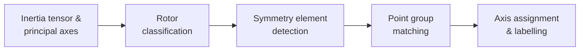

# Algorithm & Supported Groups

## How the algorithm works



1. **Inertia tensor → principal axes.** The 3×3 inertia tensor is diagonalised
   via `numpy.linalg.eigh`, yielding three principal moments and axes.
2. **Rotor classification.** Degeneracy of the moments classifies the molecule
   into one of five types (*Linear*, *Spherical Top*, *Prolate Symmetric Top*,
   *Oblate Symmetric Top*, *Asymmetric Top*), pruning the candidate search space.
3. **Symmetry element detection.** Candidate axes are generated from principal
   axes, atom positions, and pair midpoints. For each candidate axis, the
   rotation orders tested are bounded by the size of the largest ring of
   symmetry-equivalent atoms found around it (capped at n = 20). Each candidate
   is tested by applying the transformation matrix and checking that every atom
   maps onto a same-element atom within a tolerance of 10% of the distance to
   the symmetry element (tightened for high-order axes to avoid confusing
   neighbouring orders, e.g. C9 vs C8).
4. **Point group matching.** Detected operation counts are compared against a
   library of point groups. If the operations don't match any hardcoded group
   (e.g. an axis order greater than the hardcoded range), a character table is
   generated on the fly for the inferred family and order. The group with the
   smallest non-negative surplus of operations is selected.
5. **Axis assignment and labelling.** The Cartesian frame is standardised (z
   along the highest-order proper rotation; x to maximise atoms in the
   xz-plane) and operations are labelled (σₕ, σᵥ, σd, C₂′, C₂″).

!!! tip "Why classify the rotor first?"
    Step 2 isn't just a label — it dramatically narrows the search in step 3.
    A *Spherical Top* (all three moments equal) can only belong to a cubic or
    icosahedral group, so candidate axes for those families are tried first;
    an *Asymmetric Top* (all three moments different) can have at most a C₂
    axis, ruling out most high-order candidates before any expensive
    transformation checks run.

---

## Detecting high-order axes (n > 10)

Earlier versions hard-capped the proper-rotation search at n ≤ 8. Detection now
adapts all the way up to n = 20, through three independent mechanisms that work
together.

### 1. Geometry-bounded search order

A Cₙ axis can only exist if there is a *ring* of at least n symmetry-equivalent
atoms around it. So rather than blindly testing every order up to some fixed cap
(slow, and prone to false positives), for each candidate axis `pyrrhotite` first
groups the atoms by **same element, same perpendicular distance from the axis,
and same projection along the axis** (each compared within 0.1), and takes the
largest such group as the ceiling for n, clamped to [2, 20]. Atoms lying
essentially *on* the axis map to themselves under any rotation and are excluded
from the count. This both prunes the search to orders the geometry could actually
support, **and** prevents "inventing" a high order in a molecule that has no such
ring.

### 2. Order-dependent validation tolerance

The base acceptance tolerance is a **relative 10%** — the per-atom mismatch is
normalised by the distance to the symmetry element, not a fixed 0.1 Å — which
makes it scale-free across large and small molecules. For high orders
(degree ≥ 8) it is tightened to:

```text
threshold = min(0.1, π / (degree · (degree + 1)))
```

Why this is necessary: adjacent rotation orders crowd together as n grows. C₉ is
a 40° rotation, C₈ is 45° — only 5° apart. Applying the *wrong* C₈ rotation to a
genuine C₉ ring produces a normalised error of ~0.087, which slips under a fixed
0.1 and would validate **both** orders. The tightened bound is roughly half the
angular gap to the next order (≈ 0.044 rad at degree 8, shrinking as ~1/n²), so
only the true order passes.

### 3. Matching that respects the highest detected axis

Detecting a high-order axis is useless if point-group *matching* then falls back
to a low-order hardcoded group. Matching now requires the chosen group to account
for the highest detected **proper *and* improper** axis; otherwise the character
table is generated analytically on the fly. This is what stopped a detected C₁₁
from being mislabelled D₂ₕ, or an S₁₂ from collapsing to C₆.

!!! question "Is the fixed 10% tolerance a problem?"
    Not for what it's mainly for. The relative 10% is deliberately forgiving so
    that real, finite-precision `.xyz` coordinates still validate — and a *wrong*
    axis doesn't produce a borderline error, it produces one far above the
    threshold. The genuine weaknesses are (a) **neighbouring-order confusion at
    high n**, which is addressed by the order-dependent tightening above rather
    than by changing the base 10%, and (b) **slightly distorted geometries**,
    which a fixed global tolerance can occasionally over-accept (a listed
    limitation). The principled fix for pushing further isn't to loosen 10% — it
    is to make the tolerance *configurable* (see the roadmap below), so clean or
    synthetic geometries can be detected with a tighter bound.

---

## Supported point groups

Symmetry **detection** (from an `.xyz` file) currently covers:

| Family | Groups |
|---|---|
| Non-axial | C₁, Cᵢ, Cₛ |
| Cyclic | C₂ – C₂₀* |
| Cyclic with σₕ | C₂ₕ – C₂₀ₕ* |
| Cyclic with σᵥ | C₂ᵥ – C₂₀ᵥ* |
| Improper axes | S₄ – S₂₀* (even orders) |
| Dihedral | D₂ – D₂₀* |
| Dihedral with σₕ | D₂ₕ – D₂₀ₕ*, D∞ₕ |
| Dihedral with σ<sub>d</sub> | D₃<sub>d</sub> – D₂₀<sub>d</sub>* |
| Cubic | T, Td, Tₕ, O, Oₕ |
| Icosahedral | I, Iₕ |
| Linear | C∞ᵥ, D∞ₕ |

\* The maximum detectable rotation order is **adaptive**: for each candidate
axis, `pyrrhotite` looks for the largest "ring" of symmetry-equivalent atoms
(same element, same distance from the axis, same position along the axis) and
only tests Cₙ orders up to that ring size, capped at n = 20. So detecting a Cₙ
axis still requires an actual n-fold ring of equivalent atoms in the structure
— `pyrrhotite -g C20v` works for *any* molecule shape via the on-the-fly
character table generator below, but *detecting* C20v from coordinates requires
a molecule with a genuine 20-fold ring.

**Character table generation** is more general: all 18 Schoenflies classes are
supported, and the seven axial families (Cn, Cnh, Cnv, Sn, Dn, Dnh, Dnd) are
generated analytically for *any* order n ≥ 2 — not just the ranges above. So
`pyrrhotite -g C30v` works even for orders beyond the detection cap.

---

## Known limitations

!!! warning "The n = 20 detection cap is fundamental, not arbitrary"
    Symmetry **detection** from `.xyz` coordinates adapts the maximum tested
    rotation order to the molecule's geometry (capped at n = 20, see
    [Supported point groups](#supported-point-groups)) — a Cₙ axis can only be
    detected if the molecule actually has an n-fold ring of equivalent atoms.
    **Character table generation** for named groups has no such limit for the
    axial families.

    - The per-degree validation tolerance shrinks roughly as 1/n², and beyond
      n ≈ 20 it approaches the noise floor of typical `.xyz` coordinates
      (3-4 decimal places, propagated through inertia-tensor diagonalization
      and Rodrigues rotation), risking both missed high-order axes and renewed
      confusion between neighbouring orders.
    - Even without that limit, a Cₙ axis can only be *detected* if the molecule
      actually contains an n-fold ring of symmetry-equivalent atoms — raising
      the cap only matters for molecules that physically have such rings.
    - The ring search is O(atoms²) per candidate axis (on top of the existing
      O(atoms²) candidate generation), so a higher cap increases the constant
      factor for large molecules without changing the overall complexity.

- Fixed 10% tolerance — slightly distorted geometries may be misclassified.
- Single isolated molecules only; crystal structures and space groups are not
  supported.
- The 3-D visualizer shows the molecule and an axis gizmo, but does not yet
  draw the detected symmetry elements (rotation axes, mirror planes) on top of
  it.

!!! info "Working around a limitation?"
    If one of these limits is blocking something you're trying to do — e.g.
    you have a genuinely high-symmetry molecule, or need crystal/space-group
    support — see [About → Contact](about.md#contact); these are exactly the
    kind of real-world cases that help prioritise future work.

??? example "Roadmap: turning these limitations into goals"
    None of these are committed or scheduled — just the most natural next
    steps for directly addressing the limitations above.

    - [ ] Draw detected symmetry elements (rotation axes, mirror planes, the
          inversion centre) as an overlay in the 3-D visualizer
    - [ ] Configurable detection tolerance, for slightly distorted or
          experimentally-derived geometries
    - [ ] A configurable (rather than fixed) detection cap, for genuinely
          high-symmetry molecules with large rings
    - [ ] Crystal structure / space group support

    Have a use case that needs one of these sooner rather than later? See
    [About → Contact](about.md#contact) — real examples are exactly what helps
    prioritise this list.

---

## Next steps

<div class="grid cards" markdown>

-   :material-api:{ .lg .middle } __API Reference__

    ---

    The exact signatures, parameters, and return types for every public
    function and class.

    [:octicons-arrow-right-24: Open the reference](api.md)

-   :material-book-alphabet:{ .lg .middle } __Glossary__

    ---

    Definitions for the symmetry and point-group terms used throughout these
    docs.

    [:octicons-arrow-right-24: Open the glossary](glossary.md)

-   :material-book-open-variant:{ .lg .middle } __User Guide__

    ---

    Put the algorithm to work through the full Python API.

    [:octicons-arrow-right-24: Open the User Guide](user-guide.md)

</div>
