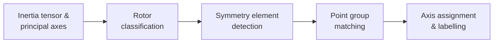

# Algorithm & Supported Groups

## How the algorithm works

1. **Inertia tensor → principal axes.** The 3×3 inertia tensor is diagonalised
   via `numpy.linalg.eigh`, yielding three principal moments and axes.
2. **Rotor classification.** Degeneracy of the moments classifies the molecule
   into one of five types (*Linear*, *Spherical Top*, *Prolate Symmetric Top*,
   *Oblate Symmetric Top*, *Asymmetric Top*), pruning the candidate search space.
3. **Symmetry element detection.** Candidate axes are generated from principal
   axes, atom positions, and pair midpoints. For each candidate axis, the
   rotation orders tested are bounded by the size of the largest ring of
   symmetry-equivalent atoms found around it (capped at n = 20). Each candidate
   is tested by applying the transformation matrix and checking that every atom
   maps onto a same-element atom within a tolerance of 10% of the distance to
   the symmetry element (tightened for high-order axes to avoid confusing
   neighbouring orders, e.g. C9 vs C8).
4. **Point group matching.** Detected operation counts are compared against a
   library of point groups. If the operations don't match any hardcoded group
   (e.g. an axis order greater than the hardcoded range), a character table is
   generated on the fly for the inferred family and order. The group with the
   smallest non-negative surplus of operations is selected.
5. **Axis assignment and labelling.** The Cartesian frame is standardised (z
   along the highest-order proper rotation; x to maximise atoms in the
   xz-plane) and operations are labelled (σₕ, σᵥ, σd, C₂′, C₂″).

---

## Supported point groups

Symmetry **detection** (from an `.xyz` file) currently covers:

| Family | Groups |
|---|---|
| Non-axial | C₁, Cᵢ, Cₛ |
| Cyclic | C₂ – C₂₀* |
| Cyclic with σₕ | C₂ₕ – C₂₀ₕ* |
| Cyclic with σᵥ | C₂ᵥ – C₂₀ᵥ* |
| Improper axes | S₄ – S₂₀* (even orders) |
| Dihedral | D₂ – D₂₀* |
| Dihedral with σₕ | D₂ₕ – D₂₀ₕ*, D∞ₕ |
| Dihedral with σd | D₃d – D₂₀d* |
| Cubic | T, Td, Tₕ, O, Oₕ |
| Icosahedral | I, Iₕ |
| Linear | C∞ᵥ, D∞ₕ |

\* The maximum detectable rotation order is **adaptive**: for each candidate
axis, `pyrrhotite` looks for the largest "ring" of symmetry-equivalent atoms
(same element, same distance from the axis, same position along the axis) and
only tests Cₙ orders up to that ring size, capped at n = 20. So detecting a Cₙ
axis still requires an actual n-fold ring of equivalent atoms in the structure
— `pyrrhotite -g C20v` works for *any* molecule shape via the on-the-fly
character table generator below, but *detecting* C20v from coordinates requires
a molecule with a genuine 20-fold ring.

**Character table generation** is more general: all 18 Schoenflies classes are
supported, and the seven axial families (Cn, Cnh, Cnv, Sn, Dn, Dnh, Dnd) are
generated analytically for *any* order n ≥ 2 — not just the ranges above. So
`pyrrhotite -g C30v` works even for orders beyond the detection cap.

---

## Known limitations

- Symmetry **detection** from `.xyz` coordinates adapts the maximum tested
  rotation order to the molecule's geometry (capped at n = 20, see
  [Supported point groups](#supported-point-groups)) — a Cₙ axis can only be
  detected if the molecule actually has an n-fold ring of equivalent atoms.
  **Character table generation** for named groups has no such limit for the
  axial families.
    - The n = 20 cap isn't an arbitrary round number that could just be raised:
      the per-degree validation tolerance shrinks roughly as 1/n², and beyond
      n ≈ 20 it approaches the noise floor of typical `.xyz` coordinates
      (3-4 decimal places, propagated through inertia-tensor diagonalization
      and Rodrigues rotation), risking both missed high-order axes and renewed
      confusion between neighbouring orders.
    - Even without that limit, a Cₙ axis can only be *detected* if the molecule
      actually contains an n-fold ring of symmetry-equivalent atoms — raising
      the cap only matters for molecules that physically have such rings.
    - The ring search is O(atoms²) per candidate axis (on top of the existing
      O(atoms²) candidate generation), so a higher cap increases the constant
      factor for large molecules without changing the overall complexity.
- Fixed 10% tolerance — slightly distorted geometries may be misclassified.
- Single isolated molecules only; crystal structures and space groups are not
  supported.
- The 3-D visualizer shows the molecule and an axis gizmo, but does not yet
  draw the detected symmetry elements (rotation axes, mirror planes) on top of
  it.
