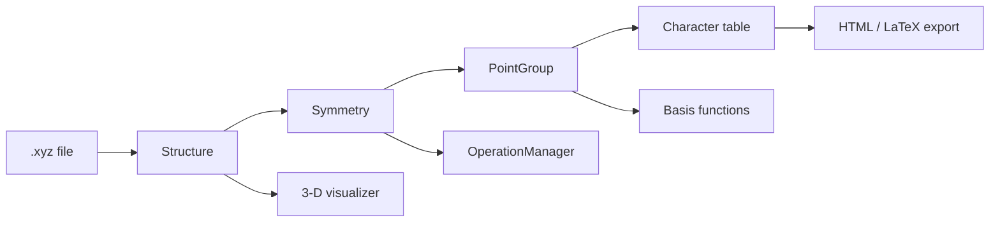

# User Guide

This page walks through the Python API in depth. For the command-line tool, see
[Getting Started](getting-started.md#command-line-reference).

!!! tip "Want one runnable script instead?"
    The repository ships [`example_usage.py`](https://github.com/datomic117/pyrrhotite/blob/main/example_usage.py),
    a single end-to-end tour that exercises every public feature in order —
    structure loading, point-group determination, character tables, the
    HTML/LaTeX exporters, the structure generator, and the 3-D viewer. It reads
    from the bundled sample molecules, so it runs as-is straight after
    `pip install pyrrhotite`:

    ```bash
    python example_usage.py
    ```

    The walkthrough below explains each piece it uses.

## How the pieces fit together

Before diving into each piece individually, here's how the main objects relate
to one another:



- **`Structure`** loads and re-centres the atoms from an `.xyz` file — or is
  built synthetically by
  [`generate_idealized_structure`](#generating-idealized-structures).
- **`Symmetry`** runs the detection pipeline described in
  [Algorithm & Supported Groups](algorithm.md) and exposes the result as a
  **`PointGroup`**, plus an **`OperationManager`** holding every individual
  symmetry operation that was found.
- A **`PointGroup`** knows its character table and basis functions, and can be
  exported to HTML/LaTeX — or obtained directly by name, with no `Structure`
  at all (see
  [Character tables for any group](#character-tables-for-any-group-no-xyz-needed)).
- A **`Structure`** can also be handed straight to the 3-D **visualizer**,
  independently of `Symmetry`.

---

## Point group determination

```python
from pyrrhotite import Structure, Symmetry

s = Structure("ammonia.xyz")
sym = Symmetry(s)

pg = sym.point_group
print(pg.label.name)        # "C3v"
print(pg.order)              # 6  (total number of symmetry operations)
```

`Structure` loads the atoms and coordinates from an `.xyz` file and automatically
re-centres the molecule on its centre of mass. `Symmetry` runs the full detection
pipeline and exposes the result as a `PointGroup`.

!!! tip "Want to see *why* a group was assigned?"
    `sym.operation_manager` gives you every individual symmetry operation that
    was detected, along with its axis and a numerical error estimate — see
    [Symmetry operations](#symmetry-operations) below.

## Character tables

A character table is a small grid that summarises everything the point group
tells you about the molecule: which combinations of atomic orbitals are allowed
to mix, and which vibrations/rotations show up in infrared or Raman spectra.

```python
# Print with rich formatting (falls back to plain if rich is not installed)
pg.print_character_table()

# Plain text
pg.print_character_table(plain=True)

# ε-notation for cyclic / Sn groups
pg.print_character_table(complex=True)

# Access the data directly
print(pg.irreps)             # list of IrrepLabel objects
print(pg.characters)         # list[list[float]] — [irrep][operation class]
print(pg.unique_operations)  # conjugacy classes (excluding E)
```

!!! note "ε-notation"
    Cyclic groups (Cₙ, Sₙ, …) with n > 2 have complex-valued irreducible
    representations. `print_character_table(complex=True)` displays these
    using ε = e^(2πi/n) notation instead of expanding them numerically — the
    conventional form used in most textbooks and reference tables.

### Character tables for any group — no XYZ needed

You can also generate a character table for a named point group without loading
any molecule. This works for all 18 Schoenflies classes — the seven axial
families (Cn, Cnh, Cnv, Sn, Dn, Dnh, Dnd) are generated analytically for any
order, and the rest (cubic, icosahedral, linear, and the low-symmetry groups)
come from a built-in table.

=== "Python"

    ```python
    from pyrrhotite.character_tables import (
        get_or_generate_point_group,
        print_character_table_for,
    )

    print_character_table_for("D4h")

    pg = get_or_generate_point_group("C12v")
    pg.print_character_table()
    ```

=== "Command line"

    ```bash
    pyrrhotite -g C3v
    pyrrhotite -g D6h --plain
    pyrrhotite -g C12v   # arbitrary order — generated on the fly
    ```

### Exporting character tables (HTML / LaTeX)

For reports, slides, or web pages, character tables can be exported directly to
HTML or LaTeX:

```python
from pyrrhotite.character_tables import format_html, save_html, format_latex, save_latex

print(format_html(["C3v", "D6h"]))          # HTML string, ready to embed in a page
save_html(["Oh"], "oh_table.html")          # write a standalone HTML file

print(format_latex(["C3v", "D6h"]))         # LaTeX string (requires \usepackage{booktabs,amsmath})
save_latex(["Oh"], "oh_table.tex")
```

The same formatters are also runnable as standalone scripts:

```bash
python -m pyrrhotite.character_tables.html_formatter C3v D6h
python -m pyrrhotite.character_tables.html_formatter Oh --save
python -m pyrrhotite.character_tables.latex_formatter Oh D4h --save tables.tex
```

The HTML is fully self-contained (it carries its own `<style>` block), so it
drops straight into any page. Here is the *actual, unedited* output of
`format_html(["C3v"])`, rendered live:

<div markdown="0">
<style>
  .char-table {
    border-collapse: collapse;
    font-family: "Latin Modern", "STIX Two Text", serif;
    font-size: 0.95em;
    margin: 1.5em auto;
  }
  .char-table caption {
    caption-side: top;
    font-weight: bold;
    margin-bottom: 0.4em;
  }
  .char-table th,
  .char-table td {
    padding: 0.35em 0.75em;
    text-align: center;
    border: 1px solid #bbb;
  }
  .char-table thead tr {
    background: #e8e8e8;
    border-bottom: 2px solid #555;
  }
  .char-table thead th:first-child {
    text-align: left;
  }
  .char-table tbody td:first-child {
    text-align: left;
    font-style: normal;
  }
  .char-table tbody tr:nth-child(even) {
    background: #f5f5f5;
  }
  .char-table tbody tr:hover {
    background: #e0ecf8;
  }
</style>

<table class="char-table">
  <caption>Character table of <i>C</i><sub>3v</sub></caption>
  <thead>
    <tr>
      <th><i>C</i><sub>3v</sub></th>
      <th><i>E</i></th>
      <th>2 <i>C</i><sub>3</sub></th>
      <th>3 <i>&sigma;</i><sub>v</sub></th>
    </tr>
  </thead>
  <tbody>
    <tr>
      <td>A<sub>1</sub></td>
      <td>1</td>
      <td>1</td>
      <td>1</td>
    </tr>
    <tr>
      <td>A<sub>2</sub></td>
      <td>1</td>
      <td>1</td>
      <td>-1</td>
    </tr>
    <tr>
      <td>E</td>
      <td>2</td>
      <td>-1</td>
      <td>0</td>
    </tr>
  </tbody>
</table>
</div>

!!! note "Self-contained, light-styled tables"
    The exported table ships with its own colours (a light grey header and
    zebra striping), so it looks identical wherever you embed it — which also
    means it keeps that light styling even on this page in dark mode. That is by
    design: the export is meant to be portable into reports and slides, not to
    inherit a host site's theme.

---

## Generating idealized structures

For testing or demonstration, `pyrrhotite` can build an idealized `Structure`
that has, by construction, a requested axial point-group symmetry — a ring (or
combination of rings) of placeholder atoms arranged as a Cn, Cnh, Cnv, Sn, Dn,
Dnh, or Dnd structure for any supported order n.

!!! info "Plausible geometry, not just placeholder points"
    The geometry of each family is modelled on a real molecule with that
    symmetry (e.g. ammonia-like apex+ring substituents for Cnv, benzene's
    ring+substituent for Cnh, ferrocene's metal-hub sandwich for
    Dn/Dnh/Dnd/Sn). Element choices roughly match each atom's bonding degree
    (H for degree 1, O for degree 2, N for degree 3, C for degree 4, S for
    degree 5-6, and a metal-like hub for higher degrees), so the generated
    structure also looks reasonable in the 3-D viewer.

!!! warning "A geometric illustration, not a chemistry tool"
    The generator's only guarantee is that the resulting arrangement of points
    has the requested point-group symmetry. The choice of elements and the bonds
    drawn between them are picked purely so the structure *looks* like a
    plausible molecule — they do **not** correspond to real, synthesisable
    compounds, realistic bond lengths, or valid valences. Most generated
    structures are not real molecules and should not be read as chemical claims.

    **Supported families:** `Cn`, `Cnh`, `Cnv`, `Sn` (even orders), `Dn`,
    `Dnh`, `Dnd`. There is no `Dnv` family — the dihedral families with mirror
    planes are `Dnh` (horizontal) and `Dnd` (diagonal). Cubic, icosahedral,
    linear, and low-symmetry groups are not generated.

    **High-order limits.** Each family is built from one or two rings of `n`
    atoms, so the rings get geometrically crowded as `n` grows — at large `n`
    the fixed-radius spheres can visually touch and the bonds get hard to read.
    The ring radius is capped so the central hub still bonds every ring atom
    (`Dn`/`Dnh`/`Dnd`/`Sn`), and a large caesium hub keeps the rings spaced, but
    these are tuned for the supported range up to **n = 20**. Beyond that the
    visual quality degrades and detection tolerances tighten (see
    [Algorithm & Supported Groups](algorithm.md)); treat very high orders as
    schematic.

```python
from pyrrhotite import generate_idealized_structure, write_xyz, Symmetry
from pyrrhotite.structure_generator import format_xyz

s = generate_idealized_structure("D12h")    # build an idealized D12h structure
print(Symmetry(s).point_group.label.name)   # "D12h"

print(format_xyz(s))                        # get it as XYZ text, no file needed
write_xyz(s, "d12h.xyz")                    # or write it straight to an .xyz file
```

To preview a generated structure without writing it to disk first, use
`visualize_idealized_structure` (requires `pip install 'pyrrhotite[vis]'`):

```python
from pyrrhotite import visualize_idealized_structure

visualize_idealized_structure("D9d")                  # opens the 3-D viewer
visualize_idealized_structure("D9d", show_labels=True)
```

=== "Python"

    ```python
    s = generate_idealized_structure("D9d")
    write_xyz(s, "d9d.xyz")
    ```

=== "Command line"

    ```bash
    pyrrhotite -g C12v --xyz                  # print the generated structure as XYZ to stdout
    pyrrhotite -g D9d --xyz d9d.xyz           # save the generated structure as XYZ to a file
    pyrrhotite d9d.xyz -v                     # then analyse the generated file as usual
    pyrrhotite -g D9d --visualize             # preview the generated structure directly
    ```

!!! tip "Round-trip testing"
    Generating a structure for a group and then immediately running
    `Symmetry(...)` on it (as in the snippet above) is a good way to sanity-check
    that detection recovers the group you asked for — `example_usage.py` (section
    14) has a runnable demo covering all seven axial families, custom
    radius/height/element, and the error cases for unsupported groups/orders.

---

## Rotor classification and principal axes

Before searching for symmetry operations, `pyrrhotite` classifies the molecule's
overall shape from its moments of inertia — this narrows down which symmetry
elements are even possible.

```python
print(sym.rotor_class)            # RotorClass.ProlateSymmetricTop

pm = sym.principal_moments        # np.ndarray shape (3,) — Ia ≤ Ib ≤ Ic in u·Å²
axes = sym.principal_axes         # np.ndarray shape (3, 3) — eigenvectors as columns
cart = sym.cartesian_axes         # 3×3 matrix [x | y | z] in the conventional frame
```

---

## Symmetry operations

Every symmetry operation found on the molecule (rotation axes, mirror planes,
inversion centre, improper rotation axes) is available individually, with its
axis and a numerical error estimate showing how well the molecule actually
matches that symmetry.

```python
manager = sym.operation_manager

for op in manager.operations:
    print(op.label.short_name)   # "C3", "C3^2", "σv", "i", …
    print(op.axis)                # unit-vector axis / plane normal
    print(op.error)               # worst-case atom mis-mapping distance (Å)

manager.proper_rotations
manager.improper_rotations
manager.reflections
manager.inversions
```

!!! note "Reading `op.error`"
    `op.error` is the worst-case distance (in Å) by which any atom misses its
    expected mapped position under that operation. A small, uniform error
    across all operations of a detected group is normal numerical noise; a
    much larger error on one operation than the others can indicate a slightly
    distorted geometry that's still close enough to pass the 10% tolerance.

---

## Basis functions

Basis functions tell you, for each irreducible representation (irrep), which
`x`, `y`, `z` coordinates, rotations, or quadratic combinations (`x²`, `xy`, …)
transform the same way — useful for working out IR/Raman selection rules and
orbital symmetries.

```python
from pyrrhotite.point_groups.basis_functions import compute_basis_functions

basis = compute_basis_functions(pg)
# Returns dict[irrep_name, {"linear": [...], "quadratic": [...]}]
for irrep, funcs in basis.items():
    print(irrep, funcs["linear"], funcs["quadratic"])
```

---

## Pretty-printing helpers

Everything above is exposed as plain Python attributes so you can format it
however you like. For quick, readable output while exploring in a shell or
notebook, `pyrrhotite.display` bundles a few ready-made printers that take the
objects you already have and print a tidy table:

```python
from pyrrhotite.display import (
    print_bond_pairs,              # bonded atom pairs, e.g. "N0 — H1"
    print_ops_with_atoms,          # each operation + the atoms on its axis/plane
    print_basis_functions,         # irrep → linear/rotational & quadratic basis
    print_char_table_programmatic, # character table built from the raw pg arrays
)

print_bond_pairs(s)                                       # s = a Structure
print_ops_with_atoms(sym.operation_manager.operations, s)
print_basis_functions(pg)                                 # pg = a PointGroup
print_char_table_programmatic(pg)
```

!!! note "Convenience wrappers, not a separate data source"
    These don't compute anything new — they're thin formatters over data that's
    already on the objects (`s.calculate_bond_pairs()`, `pg.characters`,
    `pg.irreps`, …). Use them for a quick look; reach for the underlying
    attributes when you need the values programmatically. They live under
    `pyrrhotite.display` rather than the top-level package namespace. See the
    [API reference](api.md#display-helpers) for the individual signatures, and
    `example_usage.py` (sections 1, 4, 6, 7) for each one in context.

---

## Element data

```python
from pyrrhotite.periodic_table import get_element, get_atomic_number

el = get_element(6)
print(el.symbol)   # "C"
print(el.mass)     # 12.011

n = get_atomic_number("Fe")   # 26
```

---

## 3-D visualizer

`pyrrhotite` includes a small interactive viewer for checking *what the molecule
actually looks like* before or after analysis. It draws atoms as colour-coded
spheres, bonds as cylinders, and a small red/green/blue arrow gizmo in the corner
showing the x/y/z axes.

```python
from pyrrhotite import Structure, visualize

s = Structure("ammonia.xyz")
visualize(s)                      # opens a window
visualize(s, show_labels=True)    # also overlay element symbols (N, H, H, H, ...)
```

Controls: **left-click and drag** to rotate the molecule, **scroll** to zoom.

This requires the optional `vis` dependencies (PyQt6, PyOpenGL, pyrr):

```bash
pip install 'pyrrhotite[vis]'
```

If they aren't installed, `visualize()` raises an `ImportError` with
instructions instead of crashing.

!!! note
    Unlike Luuk Kempen's original visualizer, this viewer does not (yet) draw
    the detected symmetry elements (axes, mirror planes) on top of the molecule
    — it shows only the molecule itself, the axis gizmo, and optional atom
    labels.

---

## Sample molecules

For learning and quick experiments, `pyrrhotite` bundles 32 `.xyz` files
covering all major point-group families (water, ammonia, benzene, ferrocene,
buckminsterfullerene, ...). These are exposed through a few convenience
functions:

```python
from pyrrhotite import (
    list_sample_molecules,
    load_sample,
    analyse_sample,
    visualize_sample,
    show_character_table_sample,
)

list_sample_molecules()        # ['E-hex-3-ene', 'adamantane', 'ammonia', ...]

s = load_sample("benzene")     # returns a Structure
analyse_sample("benzene")      # prints point group + rotor class
show_character_table_sample("benzene")   # prints the character table

visualize_sample("buckminsterfullerene")  # opens the 3-D viewer (requires [vis])
analyse_sample()               # no name -> picks a random sample molecule
```

!!! tip "Good starting points for each rotor class"
    `analyse_sample()` with no argument picks a random molecule — handy for
    quickly seeing a variety of point groups and rotor classes without
    sourcing your own `.xyz` files. Combine it with `visualize_sample(...)` to
    see the geometry that produced a given result.
